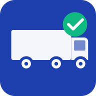

# YardCheck User Guide

## **YardCheck**
### User Guide

**Version 1.0**

*Trucking Yard Inspection Application*

---

## Table of Contents

1. [Getting Started](#1-getting-started)
2. [For Inspectors](#2-for-inspectors)
3. [For Admins](#3-for-admins)
4. [Checklist Reference](#4-checklist-reference)
5. [Troubleshooting](#5-troubleshooting)
6. [Quick Reference Card](#6-quick-reference-card)

---

## 1. Getting Started

### What is YardCheck?

YardCheck is a mobile-friendly web application designed to streamline trucking yard inspections. It allows inspectors to perform systematic checks of trucks, track inspection status in real-time, and generate professional PDF reports.

### App URL

Access YardCheck at: **https://yardcheck-543d0.web.app**

### Installing on iPhone/iPad

1. Open Safari and navigate to the YardCheck URL
2. Tap the **Share** button (square with an arrow pointing up)
3. Scroll down and tap **"Add to Home Screen"**
4. Give the app a name (or keep "YardCheck")
5. Tap **"Add"**

The YardCheck icon will now appear on your home screen for quick access.

### Installing on Android

1. Open Chrome and navigate to the YardCheck URL
2. Tap the **Menu** button (three dots in the top right)
3. Tap **"Install app"** or **"Add to Home screen"**
4. Confirm by tapping **"Install"**

The YardCheck icon will now appear in your app drawer and home screen.

---

## 2. For Inspectors

### Logging In

1. Open YardCheck in your browser or from your home screen
2. Under **"Inspector Login"**, select your name from the dropdown
3. Tap **"Start Inspection"**

### Starting a New Inspection

1. After logging in, you'll see the Truck Entry page
2. Enter the truck number in the input field
3. Tap **"Start New Inspection"**
4. You'll be taken to the inspection checklist

### Working Through the Checklist

The inspection consists of two sections:

- **Interior Items** (6 items) - Documents and materials inside the cab
- **Exterior Items** (8 items) - External compliance and safety items

For each item:
1. Tap the appropriate status button (Yes, No, Added, In-Date, Out-of-Date)
2. The item will be marked with your selection
3. Progress is saved automatically

### Adding Comments to Items

1. Tap the **comment icon** next to any checklist item
2. Enter your notes or observations
3. Comments are saved automatically and included in reports

### Working with a Partner

YardCheck supports collaborative inspections:

1. When you enter a truck number, you'll see if an inspection is already in progress
2. Tap **"Join Inspection"** to work alongside another inspector
3. Both inspectors can update items simultaneously
4. All changes sync in real-time between devices

### Real-time Sync

- Changes made by any inspector are immediately visible to all others
- The app shows a connection status indicator (green = connected, yellow = syncing)
- Even if connection is temporarily lost, changes will sync when reconnected

### Completing an Inspection

When you've finished checking all items, you have three options:

- **Mark Complete** - Inspection is finished and truck is ready
- **Gone** - Truck has left before inspection could be completed
- **Save Incomplete** - Save current progress for later completion

### Working Offline

YardCheck continues to work even without an internet connection:

- All inspection data is saved locally on your device
- When connection is restored, data automatically syncs to the server
- A yellow indicator shows when you're working offline

---

## 3. For Admins

### Accessing the Admin Dashboard

1. Open YardCheck and scroll to **"Admin Access"**
2. Select your admin name from the dropdown
3. Tap **"Open Dashboard"**

### Understanding the Stats Cards

The dashboard displays four key metrics:

| Stat | Description |
|------|-------------|
| **Total Inspections** | All inspections in the system |
| **Completed Today** | Inspections finished on the current day |
| **In Progress** | Currently active inspections |
| **Completion Rate** | Percentage of completed vs total inspections |

### Using Filters

The dashboard provides several filtering options:

- **Search** - Filter by truck number
- **Status** - All Statuses, In Progress, Complete, or Gone
- **Date Range** - Select start and end dates
- **Inspector** - Filter by specific inspector

### Viewing Inspection Details

1. Click any row in the inspection table
2. A modal will open showing:
   - All checklist items and their status
   - Inspector names
   - Timestamps
   - Comments

### Exporting PDF Reports

#### Individual Inspection Report
1. Click on an inspection to open details
2. Click the **"Download PDF"** button
3. A professional PDF report will be generated

#### Daily Report
1. Click the **"Daily Report"** button in the header
2. Select the date for the report
3. Click **"Generate Report"**
4. All inspections for that day will be compiled into a single PDF

### Managing Inspectors

Access inspector management by clicking **"Manage Inspectors"** in the header.

#### Add New Inspector
1. Enter the inspector's name
2. Check **"Admin Access"** if they need dashboard access
3. Click **"Add Inspector"**

#### Deactivate Inspector
- Click the **toggle** next to an inspector's name to deactivate them
- Deactivated inspectors won't appear in login dropdowns

#### Reactivate Inspector
- Scroll to the **"Inactive Inspectors"** section
- Click the **toggle** to reactivate

### Changing Inspection Status to "Gone"

1. Open the inspection details
2. Click **"Mark as Gone"** button
3. This is useful when a truck leaves before inspection is complete

---

## 4. Checklist Reference

### Interior Items (6 Items)

| Item | Options | Description |
|------|---------|-------------|
| **Registration** | Yes / No / Added | Vehicle registration document |
| **IFTA Card** | Yes / No / Added | International Fuel Tax Agreement card |
| **ELD Instruction Sheet** | Yes / No / Added | Electronic Logging Device instructions |
| **Accident Hotline Card** | Yes / No / Added | Emergency contact card for accidents |
| **Insurance Card** | Yes / No / Added | Proof of insurance |
| **Blank Log Books** | Yes / No / Added | Paper log books for backup |

**Status Options:**
- **Yes** - Item is present
- **No** - Item is missing
- **Added** - Item was missing but has been added

### Exterior Items (8 Items)

| Item | Options | Description |
|------|---------|-------------|
| **DOT Annual** | In-Date / Out-of-Date | DOT annual inspection sticker |
| **IFTA Sticker** | Yes / No / Added | IFTA compliance sticker |
| **Tag** | In-Date / Out-of-Date | License plate/registration tag |
| **HUT Sticker** | Yes / No / Added | Highway Use Tax sticker |
| **Fire Extinguisher** | Yes / No | Fire safety equipment |
| **Triangles** | Yes / No | Warning triangles |
| **Tires** | Yes / No | Tire condition acceptable |
| **Mudflaps** | Yes / No | Mudflaps present and intact |

---

## 5. Troubleshooting

### Common Issues and Solutions

| Issue | Solution |
|-------|----------|
| **Can't see my name in dropdown** | Contact an admin to add or reactivate your account |
| **Changes not saving** | Check connection status; data saves locally and syncs when connected |
| **App not loading** | Try refreshing the page or clearing browser cache |
| **PDF not downloading** | Check popup blockers; try a different browser |
| **Can't join an inspection** | Ensure the truck number matches exactly |
| **Inspection stuck "In Progress"** | An admin can mark it as "Gone" or complete it |

### Offline Mode

YardCheck is designed to work offline:

1. **Green indicator** - Connected and syncing normally
2. **Yellow indicator** - Offline or reconnecting
3. All changes are queued and will sync automatically
4. You can continue working normally while offline

### How to Refresh/Update the App

#### On Mobile (Installed PWA)
1. Open the app
2. Pull down from the top to refresh
3. Or close and reopen the app

#### In Browser
1. Press **Ctrl+F5** (Windows) or **Cmd+Shift+R** (Mac)
2. Or click the refresh button while holding Shift

#### Clear Cache (if having issues)
1. Go to browser settings
2. Find "Clear browsing data"
3. Select "Cached images and files"
4. Clear and reload YardCheck

---

## 6. Quick Reference Card

### Inspector Quick Actions

| Action | Steps |
|--------|-------|
| **Start Inspection** | Login → Enter truck # → Start |
| **Mark Item** | Tap status button (Yes/No/Added) |
| **Add Comment** | Tap comment icon → Type → Save |
| **Complete** | Finish all items → "Mark Complete" |
| **Join Existing** | Enter truck # → "Join Inspection" |

### Admin Quick Actions

| Action | Steps |
|--------|-------|
| **View Details** | Click inspection row |
| **Download PDF** | Open details → "Download PDF" |
| **Daily Report** | Header → "Daily Report" → Select date |
| **Add Inspector** | "Manage Inspectors" → Enter name → "Add" |
| **Filter Results** | Use search, status, date, or inspector filters |

### Keyboard Shortcuts (Desktop)

| Shortcut | Action |
|----------|--------|
| **Ctrl+F** | Search/Filter |
| **Esc** | Close modal |
| **Enter** | Confirm action |

### Status Icons

| Icon/Color | Meaning |
|------------|---------|
| 🟢 Green Badge | Complete |
| 🔵 Blue Badge | In Progress |
| ⚪ Gray Badge | Gone |
| 🟢 Green Dot | Connected |
| 🟡 Yellow Dot | Offline/Syncing |

---

**YardCheck v1.0**

For support, contact your system administrator.

